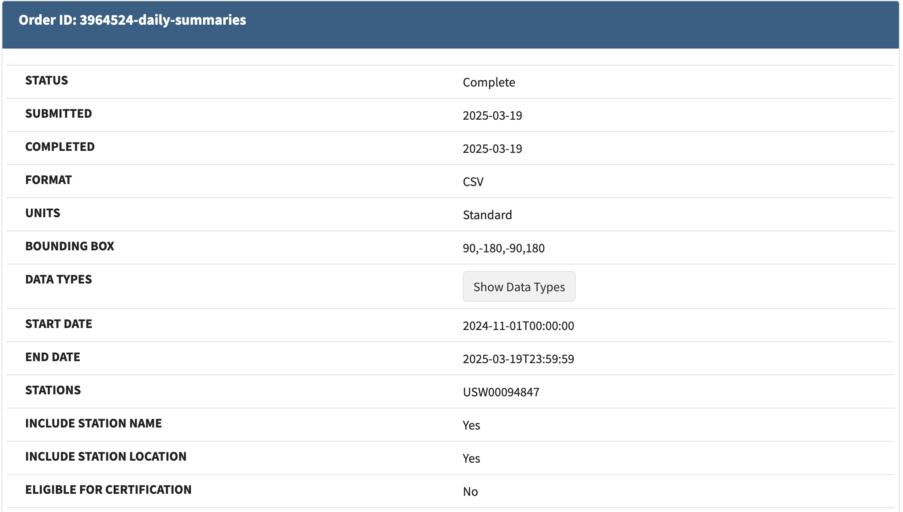

## measure compost & air temperature

the python noaa sdk can only get current observations, not historical observations. have to manually downloaded historical data.

downloaded weather data from NOAA.

data docs: <https://www.ncei.noaa.gov/pub/data/cdo/documentation/GHCND_documentation.pdf>
