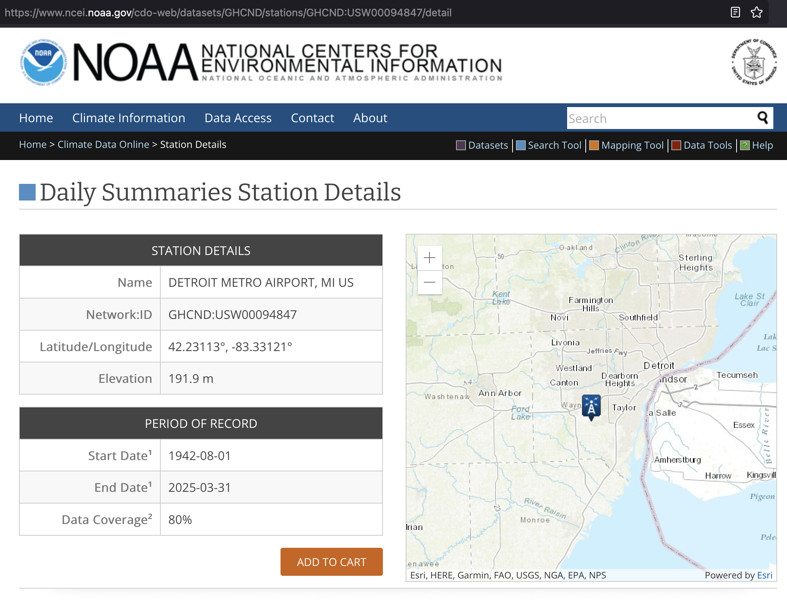
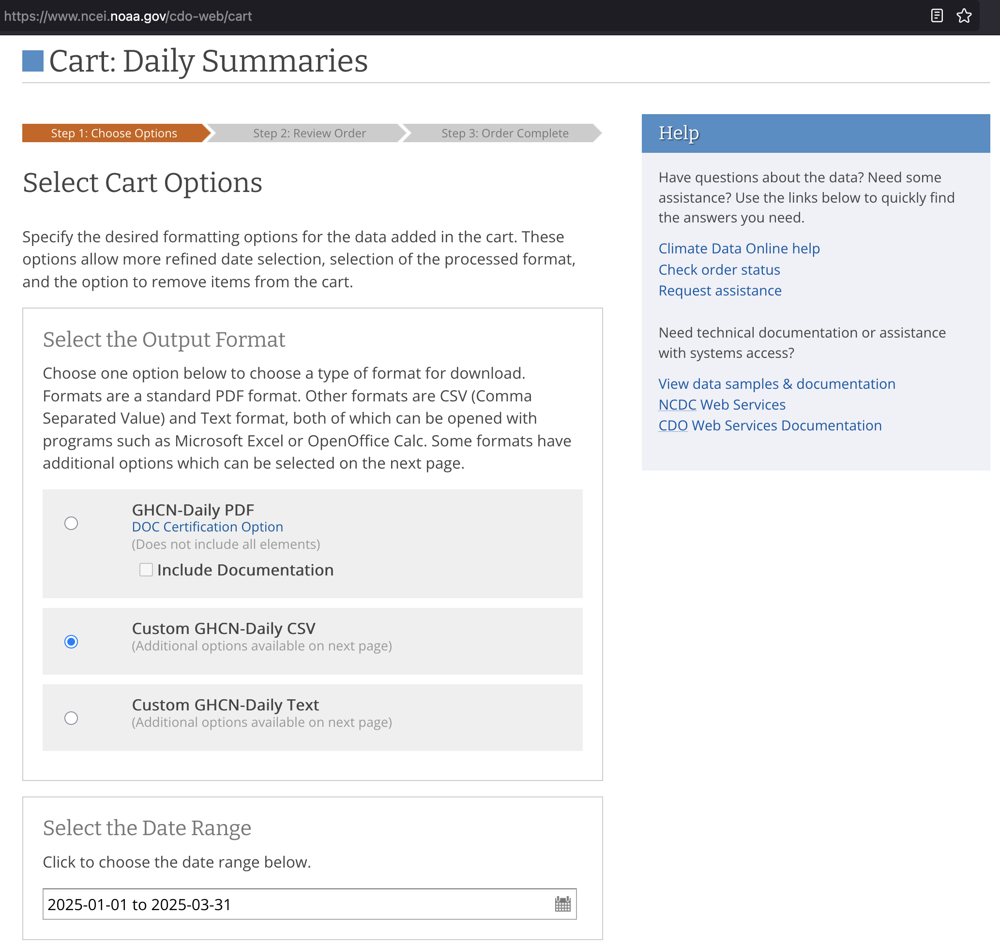
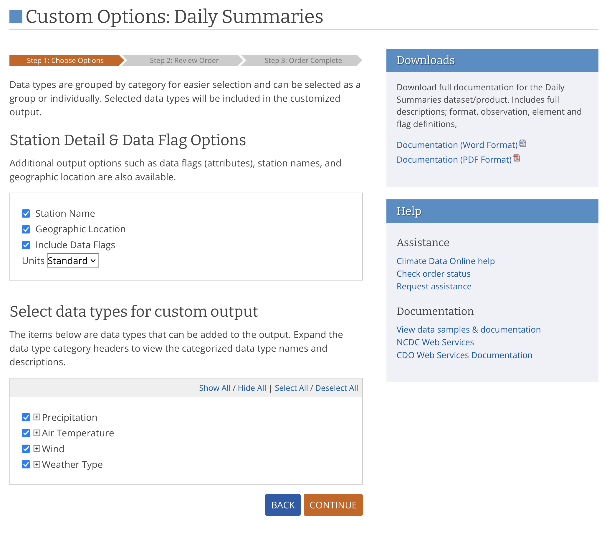
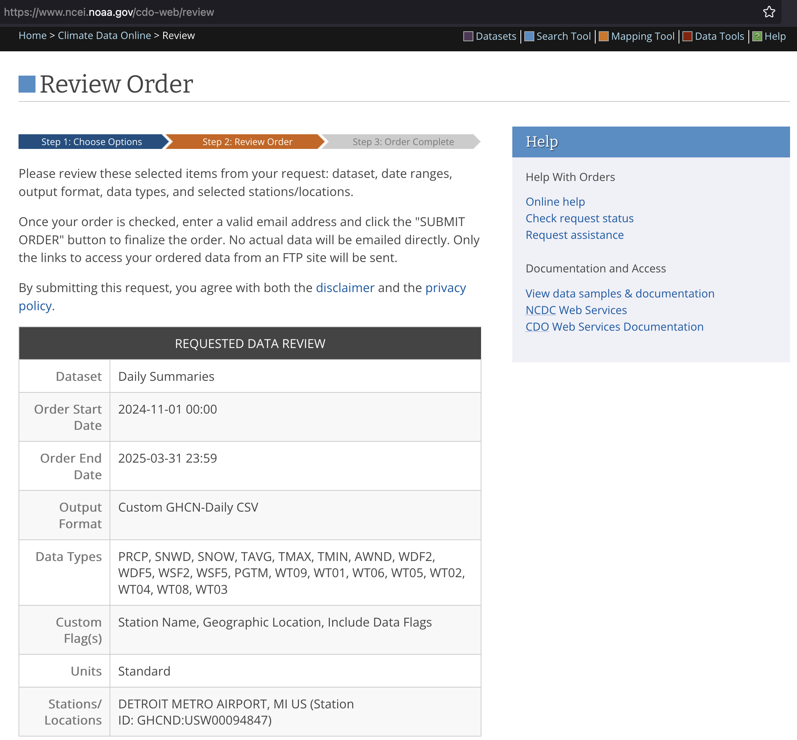

## measuring compost & air temperature

NOAA data docs: <https://www.ncei.noaa.gov/pub/data/cdo/documentation/GHCND_documentation.pdf>

### Downloaded weather data from NOAA

The python noaa sdk can only get current observations, not historical observations. Have to manually download historical data.

Select the station and click "Add to cart":

Select "daily summaries" and the desired date range, then click continue:

Check all the options and continue:

Review the order, enter your email, and submit it:

Once the dataset arrives in your inbox, place it in `data/`.
Move any prior files to `data/archive/`.
